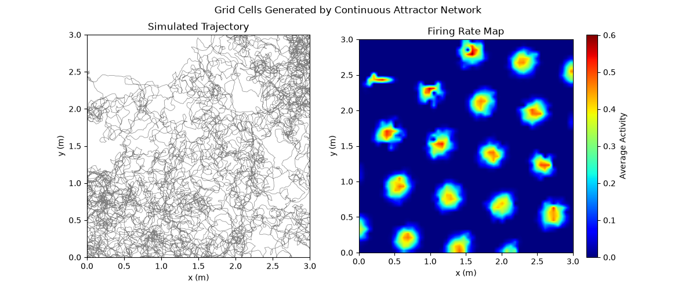

# Grid Cells
This repository contains simple Python implementations of the Oscillatory Interference (OI) and Continuous Attractor Network (CAN) models for grid cells. The code is designed to simulate the firing patterns of grid cells in a 2D environment, allowing for exploration of their unique properties and behaviours.


# Background

## Overview
Grid cells are a type of neuron found in mammalian brains, particularly in the entorhinal cortex. They bare their name due to their unique firing patterns, which form a hexagonal grid-like representation of the environment.

## Features
- **Hexagonal Firing Pattern**: Grid cells fire in a hexagonal pattern, allowing for efficient spatial representation and navigation.
- **Movement Independent**: Grid cells maintain their firing patterns regardless of the animal's movement direction or speed, providing a stable spatial map.
- **Phase Precession**: Grid cells exhibit phase precession, where the timing of their firing shifts in relation to the animal's position within the grid, enhancing spatial encoding.
- **Variable Scale**: Grid cells can operate at different scales, allowing for the representation of both small and large environments.

## Models for Grid Cells

### Oscillatory Interference Model [Burgess, N., Barry, C., & O'Keefe, J. (2007).](https://www.ovid.com/10.1002/hipo.20327)
The oscillatory interference model suggests that grid cell firing patterns arise from the interference of multiple oscillatory inputs. These oscillations can be influenced by the animal's movement and speed, leading to the formation of the hexagonal grid pattern. Assuming a linear relation between frequency and velocity, the phase difference is proportional to the distance travelled by the animal, leading to the formation of a grid-like firing pattern.

Combining oscillators with different directional preferences can lead to the formation of a hexagonal grid pattern, as the interference of these oscillations creates peaks in firing at specific spatial locations.

### Continuous Attractor Network Model [Burak, Y. & Fiete, I. R. (2009)](https://dx.plos.org/10.1371/journal.pcbi.1000291) & [Zhang, K. (1996)](https://www.jneurosci.org/content/16/6/2112)
The continuous attractor network model proposes that grid cells are part of a network of neurons that maintain a stable representation of space through recurrent connections. In this model, the activity of grid cells is influenced by the activity of neighbouring cells, allowing for the formation of a continuous representation of the environment. This representation can be thought of as a "bump" of activity that moves across the network as the animal navigates through space.

## Example figure

The figure generated by the implementation in the `plots` directory is shown below:




## Installation
Activate your virtual environment and install the required dependencies using pip:
```bash
python -m venv venv
source venv/bin/activate
```

Next, you install the package in editable mode using pip:
```bash
pip install -e .
```


When committing changes it is advised to run `nbstripout` to remove output from the notebooks. To set up `nbstripout` for this repository, run the following command in the root directory of the repository:
```bash
nbstripout --install
```

The models can be run with the provided jupyter notebooks in the `notebooks` directory. The notebooks contain code for simulating the OI and CAN models, as well as visualizing the resulting grid cell firing patterns.